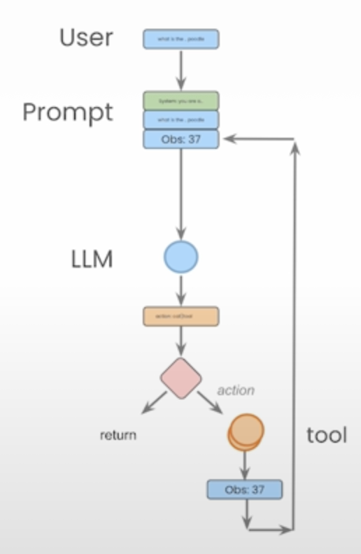

# AI Agents — DeepLearning.AI Course Repository

This repository contains my work and experiments from the **AI Agents course by DeepLearning.AI**.  
It focuses on understanding how to build and reason about **AI agents**, particularly those powered by OpenAI’s agent framework.

---

## Section 1 — Introduction to AI Agents

In this first section, I explore the fundamental concepts behind agents — autonomous systems that can **reason**, **act**, and **learn** through interaction with their environment.

In the first section, I'm testing a simple example agent with two methods:
- `average_dog_weight` — a function that returns the average weight of a dog breed.
- `calculate` — a function that performs basic mathematical operations.

These functions demonstrate how an agent can use tools (or functions) to perform tasks based on a goal or user query.

---

## The Agent Loop

A key idea introduced in this section is the **agent reasoning loop**, which can be summarized as:

> **Thought → Action → PAUSE → Observation**

- **Thought** — The agent considers what to do next.  
- **Action** — It performs a tool call (e.g., a function invocation).  
- **PAUSE** — The system waits for the action result.  
- **Observation** — The agent receives the outcome and updates its reasoning.  

This loop repeats until the agent determines that it has reached a final answer or outcome.

## Section 2: AgentState, LangGraph, and the Persistence Layer

### LangChain Components

- **Prompt Templates:**  
  Reusable templates that include dynamic variables such as `{tools}`, `{tool_names}`, and `{input}`.  
  Example structure:  

- **Tools:**  
External functions or APIs that the agent can call to perform actions (e.g., a calculator, a search tool, or a database query).

- **Function that Loops / Execution Control:**  
LangGraph helps you **describe and control execution** using **directed acyclic graphs (DAGs)** and **persistence**.  

---
## LangGraph Overview

LangGraph extends LangChain by supporting **graph-based agent flows**.  
This makes it possible to design complex and controlled reasoning pipelines.

- **Single- and Multi-Agent Flows:**  
Defined as graphs that describe how agents and tools interact.  

- **Extremely Controlled Flows:**  
Each node and edge explicitly defines the logic and transitions, giving you predictable behavior.

- **Built-in Persistence:**  
LangGraph supports saving and restoring the graph state, enabling **human-in-the-loop** workflows.

> **Human-in-the-loop** means a person can review, approve, or modify the agent’s actions or decisions before continuing the process.

### Graph Components



| Concept | Meaning |
|----------|----------|
| **Nodes** | Represent agents or functions |
| **Edges** | Connect nodes to indicate data or control flow |
| **Conditionals** | Define decision points |
| **Action Edge** | Executes a function node |
| **Entrypoint / Endpoint** | Define the start and end of the graph |

---

### State and Persistence Layer

- **Agent State:**  
The current data or context the agent uses during reasoning. This state is accessible to all parts of the graph.

- **Persistence Layer:**  
The **persistence layer** is the component of an AI agent system responsible for **storing and retrieving data that must persist beyond a single reasoning cycle or run**.  
It allows the agent to remember information between executions—such as context, prior actions, or user data.

### Tavily Integration

**Tavily** is a search engine specifically designed for AI agents and applications.  
It acts as a **web access layer** that provides **real-time, factual information** through APIs, helping agents overcome the knowledge limitations of LLMs (which are trained on past data)

## Section 3: Persistence and Streaming

**Persistence** and **streaming** are key features that allow AI agents to maintain state and provide real-time visibility into their reasoning process.

---

### Persistence

- **Persistence** allows you to keep the **state of an Agent** at a specific point in time.  
  This enables:
  - Returning to a previous state
  - Remembering context across long-running operations
  - Saving checkpoints between reasoning steps

- In **LangGraph**, persistence is achieved through a **checkpointer**.  
  The checkpointer tracks the **state of the agent after and between nodes** in the graph.

  Example:  
  Using the `SQLiteSaver` as the checkpointer  
  ```python
  from langgraph.checkpoint.sqlite import SqliteSaver
  checkpointer = SqliteSaver.from_conn_string(":memory:")

---

### Streaming
- Streaming allows an agent to emit a sequence of signals or events that describe what’s happening in its current state during execution.
- These streams provide visibility into the agent’s reasoning process by outputting intermediate steps or states in real time.

#### Threads in Streaming
- The thread-based stream methods return intermediate states and enable you to monitor the execution process.
- You can reinvoke the same thread using its `thread_id` to follow up with additional questions or continue from where it left off.

#### Stream Tokens
- LangGraph supports `asynchronous checkpointers` with AsyncSqliteSaver.
- **Token-level streaming** is available through `on_chat_model_stream`, which emits new tokens in real time.
- This enables event updates for the underlying stream—providing a live view of the agent’s thought process and output generation.